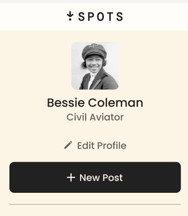

# Spots

interactive social media web application

## Description

Spots is an interactive social media web application that allows users to create profiles with a brief self-description. Users can upload images with captions, and others can engage by "liking" posts. The project features a responsive layout for the standard profile view—showcasing profile information and uploaded images—optimized for both mobile and desktop viewports.

## Tech Stack

- HTML
- CSS
- Responsive Design

## Demo Images

## Video

- [Background Video Explaining Project] (https://drive.google.com/file/d/13ExLkD9btk0qgxWMOteV2UagrmESlB8M/view?usp=drive_link)

## Deployment

This webapge is deployed to GitHub Pages

- [Deployment Link] (https://JohnReadai.github.io/se_project_spots)
